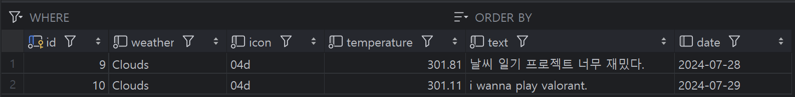
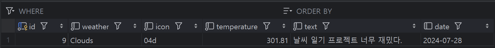

# 🌦️ 날씨 일기 프로젝트

 > 외부 API를 이용하여 날씨 데이터를 가져와 일기를 작성하는 프로젝트입니다.

 

## 🛠️ Development Environment
- 🖥️ **Intellij IDEA Ultimate**
- ☕ **Java 17**
- ☕ **Jdk 17**
- 🐬 **MySQL**
- 🔧 **Gradle 8.8**
- 🌱 **Spring Boot 3.3.2**

## 🧰 Tech Stack
- **Frameworks & Libraries**: Spring Boot, Spring Data JPA
- **Databases**: MySQL
- **JSON Parsing**: JSON.simple
- **External API Integration**: OpenWeatherMap API
- **Utilities**: Lombok, Sl4J, Logback, Swagger

## 📖 API Documentation 
### [Swagger로 API 테스트](http://localhost:8080/swagger-ui/index.html)

|Swagger|
|------|

## 최종 구현 API 리스트  

### 📘 /diary

📝 일기 작성 API

- **POST** /create/diary
  - `date` parameter로 날짜를 받아주세요. (날짜 형식: yyyy-MM-dd)
  - `text` parameter로 일기 글을 받아주세요.
  - 외부 API에서 받아온 날씨 데이터와 함께 DB에 저장해주세요.

🔍 일기 조회 API

- **GET** /read/diary
  - `date` parameter로 조회할 날짜를 받아주세요.
  - 해당 날짜의 일기를 List 형태로 반환해주세요.

📅 기간별 일기 조회 API

- **GET** /read/diaries
  - `startDate`, `endDate` parameter로 조회할 날짜 기간의 시작일과 종료일을 받아주세요.
  - 해당 기간의 일기를 List 형태로 반환해주세요.

✏️ 일기 수정 API

- **PUT** /update/diary
  - `date` parameter로 수정할 날짜를 받아주세요.
  - `text` parameter로 수정할 새 일기 글을 받아주세요.
  - 해당 날짜의 첫 번째 일기 글을 새로 받아온 일기 글로 수정해주세요.

🗑️ 일기 삭제 API

- **DELETE** /delete/diary
  - `date` parameter로 삭제할 날짜를 받아주세요.
  - 해당 날짜의 모든 일기를 지워주세요.

## 프로젝트 완성도 높이기  

🔒 트랜잭션 처리

- DB와 관련된 함수들을 트랜잭션 처리

🌤️ 날씨 데이터 저장

- 매일 새벽 1시에 날씨 데이터를 외부 API에서 받아 DB에 저장해두는 로직 구현

📝 로그 처리

- Logback을 이용하여 프로젝트에 로그처리

⚠️ 예외 처리

- ExceptionHandler를 이용한 예외처리

📑 API Documentation

- Swagger를 이용하여 API Documentation을 작성

## 📮PostMan API 테스트

| 날씨 일기 생성   | 날씨 일기 보기   |
|------------------|------------------|
|  |  |
| 날씨 일기 수정   | 날씨 일기 삭제   |
|  |  |
| 날씨 일기들 보기 |
|  |

## 🐬MySQL 데이터 처리

| 수정 전 | 수정 후 | 삭제 후 |
|---------|---------|---------|
|  |  |  |
